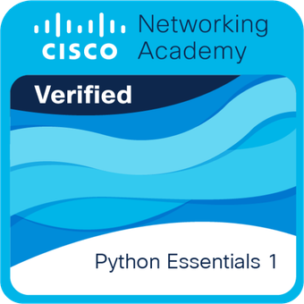

<div align="center">

# 👋 Daniel Ramirez Duque
### Senior Frontend Developer · AI Integrator · Systems Engineer

<!-- BADGES DE CONTACTO -->
[](https://www.linkedin.com/in/0dr-dev/)
[](mailto:0drd.dev@gmail.com)
[](https://github.com/0drdev/)

</div>

---

## 👨‍💻 Sobre mí

```javascript
const daniel = {
  rol:        "Senior Frontend Developer & Systems Engineer",
  ubicacion:  "Pereira, Colombia 🇨🇴",
  empresa:    "Universidad Tecnológica de Pereira",
  enfoque:    ["Accesibilidad WCAG", "IA integrada al desarrollo", "WordPress Custom Themes"],
  filosofia:  "La tecnología debe ser inclusiva. La automatización, una aliada.",
  contacto:   "0drd.dev@gmail.com",
  openTo:     ["Freelance", "Colaboraciones", "Proyectos open source"]
};
```

Soy **Ingeniero de Sistemas** con más de **4 años de experiencia** construyendo soluciones web que combinan estándares de accesibilidad, rendimiento y uso estratégico de herramientas de IA. En la **Universidad Tecnológica de Pereira** he liderado la arquitectura de sitios institucionales priorizando la experiencia del usuario final y la inclusión digital.

Mi diferencial: integro IA (Google Gemini, Claude) directamente en los flujos de desarrollo para acelerar prototipos, revisar calidad de código y automatizar tareas repetitivas.

---

## 🛠️ Stack Tecnológico

<div align="center">

### 🌐 Frontend & Web


### ⚙️ Backend & Bases de Datos


### 🤖 Herramientas & IA


</div>

---

## 🏆 Certificaciones & Logros

<div align="center">

### 🎓 Cisco Networking Academy

<table>
  <tr>
    <td align="center" width="200">
      <a href="https://www.netacad.com/courses/python-essentials-1" target="_blank">
        
        <br/>
        <b>Python Essentials 1</b>
        <br/>
        <sub>Cisco Networking Academy</sub>
        <br/>
        
      </a>
    </td>
  </tr>
</table>

</div>

---

## 💡 Lo que aporto a un equipo

<div align="center">

| 🤖 IA al servicio del código | ♿ Accesibilidad WCAG | 🎨 WordPress desde cero |
|:---:|:---:|:---:|
| Uso Google Gemini y Claude para agilizar flujos de trabajo, revisar código y prototipar más rápido | Implementación de normativas WCAG 2.1 para asegurar sitios verdaderamente inclusivos | Temas 100% personalizados sin builders pesados, limpios y administrables |

| 🔄 Modernización de sistemas | 🧠 Arquitectura institucional |
|:---:|:---:|
| Experiencia migrando entornos legacy a arquitecturas más seguras y actuales | Diseño de sitios institucionales en UTP con foco en usabilidad y mantenimiento |

</div>

---

## 📊 Estadísticas de GitHub

<div align="center">


<br/>

[](https://git.io/streak-stats)

</div>

---

## 🌱 En constante evolución

- 🔭 Actualmente construyendo mi portafolio de proyectos open source
- 📚 Profundizando en arquitecturas modernas con **React** y **Node.js**
- 🤖 Explorando el potencial de la IA aplicada al desarrollo web
- ♿ Evangelizando la **accesibilidad web** como estándar, no como opción
- 🎯 Meta 2025: Contribuir a proyectos open source relevantes

---

## 🤝 ¿Hablamos?

<div align="center">

> *"Creo firmemente que la tecnología debe ser inclusiva y que la automatización es una aliada para elevar la eficiencia del desarrollo."*

**¿Tienes un proyecto en mente? ¿Buscas un colaborador técnico? ¡Escríbeme!**

[](mailto:0drd.dev@gmail.com)
[](https://www.linkedin.com/in/0dr-dev/)

</div>

---

<div align="center">

<sub>⚡ Perfil construido con pasión desde Pereira, Colombia 🇨🇴 | Siempre aprendiendo, siempre construyendo</sub>

</div>
