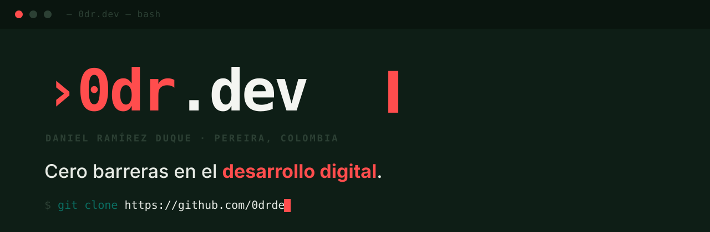

<!--
  Perfil de GitHub de 0DRDEV · Daniel Ramírez Duque
  Marca: ›0dr.dev — "Cero barreras en el desarrollo digital"
  Estética de terminal · Pine + Ember · IBM Plex Mono/Sans · Accesibilidad primero.
  Reglas: Ember solo sobre Pine · nunca comunicar solo con color · alt en toda imagen.
-->

<p align="center">
  
</p>

<p align="center">
  <a href="https://0drdev.vercel.app/"></a>
  <a href="https://www.linkedin.com/in/0drdev/"></a>
  <a href="https://instagram.com/0drdev"></a>
  <a href="https://x.com/0drdev"></a>
  <a href="mailto:danielramirezduque1@gmail.com"></a>
</p>

---

```bash
$ 0dr.dev init
```

Hola 👋 Soy **Daniel Ramírez Duque** (`@0drdev`), ingeniero de Sistemas y Telecomunicaciones
en **Pereira, Colombia**. Construyo **web accesible**, **automatización** e **IA aplicada** — y lo
explico como lo haría un buen profesor: cercano, directo y sin jerga.

El **0** de la marca significa *cero barreras*, en doble sentido: **para las personas**
(web usable por todos) y **del conocimiento** (que cualquiera pueda aprender a construir con IA).

> **Accesibilidad de verdad, no solo en el papel.** Llevo **5,5 años ejerciéndola a diario** dentro
> de un entorno regulado (Universidad Tecnológica de Pereira): **WCAG 2.1 AA** + **Ley 1712 / MinTIC**.

### `›` En qué trabajo

- 🌐 **Sitios y portafolios accesibles** — inclusivos desde el diseño, listos para escalar a IA.
- ⚙️ **Automatización de procesos** — con **n8n** y afines: menos trabajo repetitivo, más tiempo.
- 🤖 **IA aplicada** — integraciones y flujos prácticos con **Claude, ChatGPT y Gemini**.
- 🛡️ **Consultoría y auditoría** — de requisito legal (Ley 1712) a una web realmente usable.
- 🎓 **Capacitaciones personalizadas** — para dar el salto a la IA, la automatización y el desarrollo.

### `›` Con qué construyo

<p>
  
  
  
  
  
  
  
  
</p>

### `›` Prueba social

**All You Can Stitch** — tapicería artesanal y restauración de muebles en Troutman, Carolina del
Norte (USA). Le construí su presencia web para posicionar la marca: mi primer cliente, y ya internacional.
👉 *Tu proyecto puede ser el próximo caso.*

---

### `›` Para quién construyo

| Emprendes o tienes pyme | Universidad o entidad pública | Quieres aprender IA |
|---|---|---|
| Una web accesible no es un gasto: son más clientes y más alcance. | Del requisito legal (Ley 1712) a una web realmente usable. | De *"no sé por dónde empezar"* a construir y automatizar con IA. |

### `›` Comparto lo que aprendo

Escribo y publico sobre **accesibilidad digital**, **IA aplicada de forma práctica**,
**automatización y ahorro de tiempo**, y **el camino tech** (cómo avanzar por cuenta propia).
Si algo de esto te sirve, **sígueme** y hablemos — construyo comunidad, no audiencia.

<p>
  
  
  
</p>

---

<p align="center">
  <code>$ echo "¿Una web que incluya a todos o dar el salto a la IA? Hablemos."</code><br>
  <sub><b>0DRDEV</b> · <code>›0dr.dev</code> · <a href="https://0drdev.vercel.app/">0drdev.vercel.app</a> · Hecho accesible desde Pereira, Colombia</sub>
</p>
